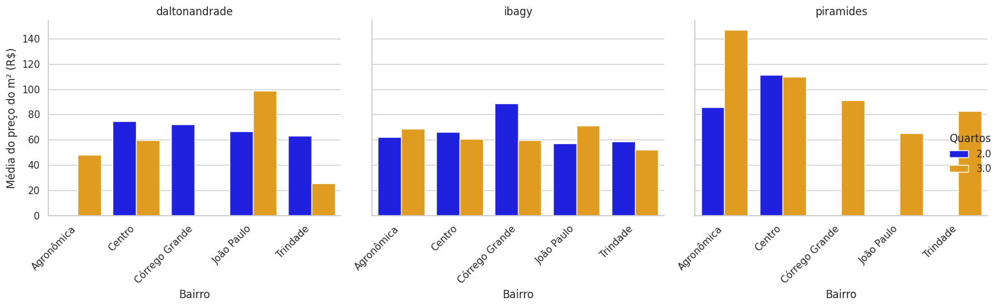

# Scraper para busca do melhor imóvel em sites de imobiliárias em Florianópolis

Um projeto para coletar imóveis residenciais de aluguel no site [ibagy.com.br](https://ibagy.com.br/aluguel/residencial/), implementado com **Scrapy** e AJAX/infinite scroll, e que:

- Pagina dinamicamente via chamadas AJAX (`?reload=0&offset=N`) para capturar todos os blocos de resultados.  
- Deduplica com base no `data-codigo` de cada imóvel.  
- Armazena tudo em `imoveis.json` na raiz do repositório.  
- Anexa somente os **novos** imóveis, salvando-os em `novos_imoveis.json`.  
- Envia um **único** e-mail resumo listando os imóveis cadastrados em cada execução.  
- Pode ser agendado localmente (via `runner.py`) para rodar a cada 8 horas.  
- **Também inclui spiders para as imobiliárias Dalton Andrade e Pirâmides, usando a mesma abordagem de infinite scroll e pipeline de notificação.**

---

## 📁 Estrutura do projeto

```
aluguel_fpolis/
├── .env                     # variáveis de ambiente (SMTP)
├── imoveis.json             # banco mestre de imóveis coletados
├── novos_imoveis.json       # saída “feed” dos itens novos a cada run
├── runner.py                # script local que agenda o scraper a cada 8h
├── scrapy.cfg               # config do Scrapy apontando para coleta.settings
└── coleta/                  # pacote Scrapy
    ├── __init__.py
    ├── settings.py          # configurações (pipelines, feeds, delay, etc)
    ├── pipelines.py         # dedupe + anexar + notificar por e-mail
    ├── spiders/
    │   ├── ibagy.py         # spider “ibagy_com_cod” com infinite scroll AJAX
    │   ├── daltonandrade_ajax.py    # spider para Dalton Andrade
    │   └── piramides_ajax.py         # spider para Pirâmides
    └── utils/
        └── email_utils.py   # função `enviar_email_resumo(...)`
```

---

## 🔧 Instalação

1. Clone este repositório:

   ```bash
   git clone https://github.com/seu-usuario/aluguel_fpolis.git
   cd aluguel_fpolis
   ```

2. Configure as variáveis de ambiente no arquivo `.env` (na raiz):

   ```ini
   EMAIL_REMETENTE=seu@gmail.com
   EMAIL_PASSWORD=sua_senha_app
   EMAIL_DESTINO=destino@exemplo.com
   ```

3. Instale as dependências com Poetry:

   ```bash
   poetry install
   ```

---

## 🚀 Uso manual

### 1. Listar spiders disponíveis

```bash
cd ~/DS/portfolio/aluguel_fpolis
poetry run scrapy list
```

Você deve ver:

```
ibagy_com_cod
daltonandrade_ajax
piramides_ajax
…
```

### 2. Executar o scraper “infinite scroll” do Ibagy

```bash
poetry run scrapy crawl ibagy_com_cod
```

- Ele irá:
  - Percorrer a página inicial (12 imóveis)  
  - Paginar via AJAX (`?reload=0&offset=N`) até cobrir o total extraído de `<p.result-totals-phrase>`  
  - Deduplicar itens já em `imoveis.json`  
  - Salvar novos em `novos_imoveis.json`  
  - Anexar esses novos ao `imoveis.json`  
  - Disparar um **único e-mail** resumo com título e link de cada novo imóvel

### 3. Executar também os scrapers das outras imobiliárias

- Dalton Andrade:
  ```bash
  poetry run scrapy crawl daltonandrade_ajax
  ```
- Pirâmides:
  ```bash
  poetry run scrapy crawl piramides_ajax
  ```

---

## 🔄 Agendamento local (a cada 8 horas)

Para rodar automaticamente em background:

1. Garanta que o `schedule` está instalado:

   ```bash
   poetry add schedule
   ```

2. Lance o `runner.py` com `nohup`:

   ```bash
   nohup poetry run python runner.py >> runner.log 2>&1 &
   ```

3. Monitore:

   ```bash
   tail -f runner.log
   ```

O `runner.py` faz:

- Primeira execução imediata  
- Agendamento `schedule.every(8).hours.do(run_scraper)`  
- Chama `scrapy crawl ibagy_com_cod` via `subprocess`  
- Loga início, fim e possíveis erros em `runner.log`

---

## 📧 Notificações por e-mail

O pipeline `ImoveisDedupAndNotifyPipeline` em `coleta/pipelines.py`:

1. Lê `imoveis.json` na inicialização e carrega todos os `codigo` já processados.  
2. No `process_item` descarta duplicados e armazena só os novos.  
3. No `close_spider`:
   - Anexa os novos ao `imoveis.json`  
   - Gera/atualiza `novos_imoveis.json`  
   - Chama `enviar_email_resumo(novos_itens)` em `coleta/utils/email_utils.py`, que envia um **único** e-mail listando todos os títulos e links dos novos imóveis  

---

## ⚙️ Configurações principais

- **Pipelines**: habilitado em `coleta/settings.py`
  ```python
  ITEM_PIPELINES = {
      "coleta.pipelines.ImoveisDedupAndNotifyPipeline": 300,
  }
  ```

- **Feeds** (`novos_imoveis.json`):
  ```python
  FEEDS = {
      "novos_imoveis.json": {
          "format": "json",
          "encoding": "utf-8",
          "overwrite": True,
          "indent": 2,
      }
  }
  ```

- **Download delay**: 0.6s entre requisições, para respeitar o servidor.

---

## 📚 Referências

- [Scrapy Docs](https://docs.scrapy.org)  
- [Schedule (Python)](https://pypi.org/project/schedule/)  
- [Scrapy AJAX pagination patterns](https://doc.scrapy.org/en/latest/topics/dynamic-content.html)

---

**Este projeto** integra scraping robusto (infinite scroll via AJAX), deduplicação incremental e notificações por e-mail, tudo orquestrado localmente via um simples scheduler em Python. Bom scraping! 🚀
